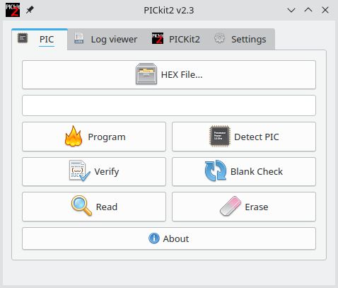

# QPICkit




Simple and quick pk2cmd front end. This is a GUI for the pk2cmd command line tool
for programming PIC microcontrollers,
using the [PICkit2](https://www.microchip.com/en-us/development-tool/pg164120)
or [ArdPicProg](https://github.com/Ho-Ro/ArdPicProg) programmer and debugger hardware.
Other programmer can be added to the file [`programmer.cpp`](programmer.cpp).

**NOTE**: You must install pk2cmd on your system first!: (The following links are given as reference only)

- ArchLinux: https://aur.archlinux.org/packages/pk2cmd-plus
- Ubuntu: https://www.microchip.com/forums/m795386.aspx or https://nathandumont.com/blog/setting-up-pk2cmd-on-ubuntu
- Other distros: https://curuxa.org/en/Pk2cmd_manual_installation

**How to build**

You must have qt, qmake and make installed in your system.

run:

```
qmake QPICkit.pro
make all -j4
make clean
```
